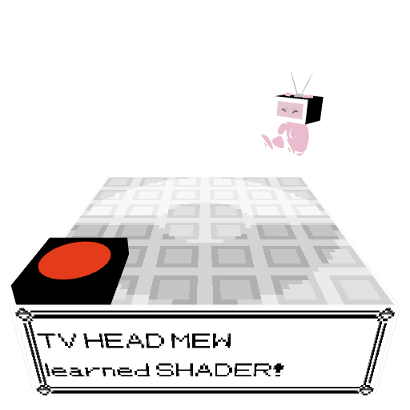
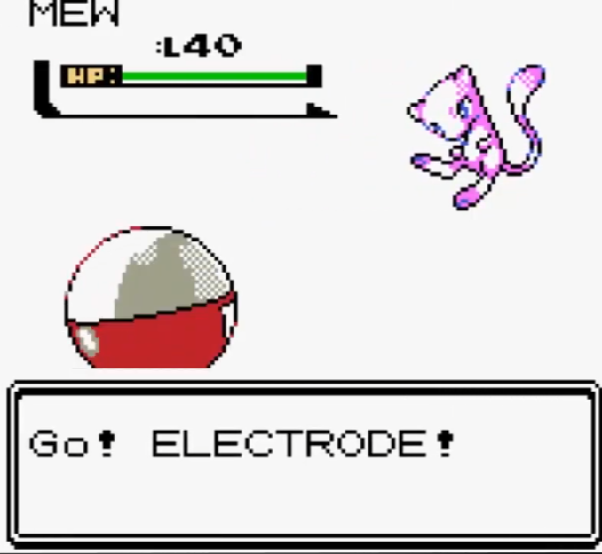

# TV Head Mew VS Red Button

I created a very short Pokemon Battle, although it's not the typical PvP you would expect. Rather, it is a PvE: TV HEAD MEW vs RED BUTTON. A battle most exciting that you would have to see for yourself!

  
SPOILER WARNING

  
  RED BUTTON's defeat becomes TV HEAD MEW's victory - as TV HEAD MEW discovers the power of the fragment shader! TV HEAD MEW changes the ADS Fragment shader to a GameBoyColor-inspired shader, the mechanisms of which are described in later sections!
  

GIF:

MP4:

https://github.com/user-attachments/assets/2541481b-a225-482f-88f1-2f3cad8b777f

This was the inspiration for the scene - a Pokemon battle in Pokemon GS!

# Logic of Code

I reused some code from my Intro to Graphics course (CSC 305) at UVic. Specifically, I reused some of the global variables, provided helper functions, and primitive objects!

## Logic of main.html

This is where the html lives, as well as the vertex and fragment shaders which are written in the OpenGL Shading Language (GLSL).

I used an ADS shader in the fragment shader, using the Blinn-Phong Model for light reflection. I also added in my own fragment shader which is applied after TV HEAD MEW defeats the RED BUTTON. This GameBoyColor-inspired shader gives a very simplistic lighting to the objects it is applied to - in order to simulate how a Pokemon battle in generation 2 would look like on the GameBoyColor!

When applying the customized shader, I omitted textures from it and instead gave them a monochrome color to stay true to the GameBoyColor look.

## Logic of main.js

This is where most of the javascript lives. The code is amply commented, but here are some design decisions to note:

- Global variables and constants were utilized to store the different colors, coordinate system translations, arrays that hold transformation information, as well variables like useTextures and mewFace that get passed on to the Fragment Shader.
- I split up the 3 main objects in this scene (stadium, mew, button) into their own functions, which each have their own helper functions. This helps in modularity, and most importantly sanity:P
- I decided to leave in a ToggleAnimation button that can pause the animation, but keep in mind that it doesn't stop the march of time (would be cool if it did)
- I also added a toggle to use either orthographic projection or perspective projection with a slider to adjust the fovy. The default for this movie is the latter with a fovy of 60.

# Highlighted Features

1. TV HEAD Mew is a hierarchical object with 5 levels in the hierarchy! Head -> Body -> Thighs -> Feet -> Soles (yes literally - look at the brown balls under his feet. Don't make it weird.)
2. Use of textures: There are technically 11 textures - 1 of which is for the stadium, 7 for the different mew faces, and 3 for the different battle texts! All are mapped on cubes.
3. ADS shader in the fragment shader.
4. Blinn-Phong Model used for light reflection.
5. Custom Shader Effect: This is explained in the "Logic of main.html" Subsection above!
6. 360-degree camera fly around: Implemented in the first and last scenes to highlight how the difference between the ADS Fragment Shader and my GameBoyColor shader.
7. Connection to real-time: synchronize animations IN real-time using timestamp.
8. Frame rate display: Displayed right under the scene, updated every 2 seconds.

# How to Run

If you try to simply open main.html without hosting the files on a local server the textures will be all black! To use textures in WebGL we have to bypass a security issue that is present with most browsers, one way is through setting up a python HTTP server:

1. Download the repo code
2. In the root directory of the files, open a terminal
3. Run the following: python -m http.server 8080
4. Open a browser and type in: localhost:8080
5. Navigate to main.html in the local server
6. Voila! Grab some popcorn and enjoy the (short) movie

# Credits

This movie wouldn't have been possible to implement without the help of some external resources!

- Credits to my Intro to Graphics course, which I reused some code from.
- Credits to Bulbapedia for the Indigo Plateau Center FRLG.png that I used for the Floor tiling (URL: https://bulbapedia.bulbagarden.net/wiki/File:Indigo_Plateau_Center_FRLG.png), as well as the creators of Pokemon FRLG.
- Credits to Random Talking Bush from The Models Resource for the mew eye textures that I used for TV HEAD MEW (URL: https://www.models-resource.com/3ds/pokemonxy/model/8334/), as well as the creators of Pokemon XY.
- Credits to dafont.com for the PKMN RBYGSC fonts which I used to make the text in the battle texts (URL: https://www.dafont.com/pkmn-rbygsc.font?text=MEW+used+EARTHQUAKE%21), as well as the creators of Pokemon GS.
- Credits to GameFreak, Creatures, and Nintendo for all things Pokemon.

# Final Remarks

This assignment was such a great challenge to undertake! Understanding GLSL, especially the vertex and fragment shaders, was as challenging as it was rewarding. I feel like I have a solid grasp on modeling objects from scratch now too, as well as a stronger understanding of the graphics pipeline. I had a strong vision of this movie before making it a reality - and am thankful that I was able to achieve what I wanted.
